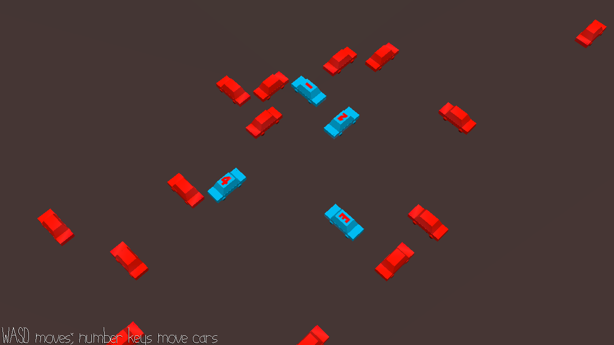

# Car Crash In Slow Motion

Author: William Ozeas

Design: Car Crash In Slow motion is a proof-of-concept puzzle that forces you to either pay attention to a lot of things
at once and/or memorize a pattern. It takes inspiration from spatial parking-lot car puzzles and makes them real-time!

Screen Shot:

How To Play:

Press 1, 2, 3, and 4 to move each corresponding car backwards by a car length. Each car can be rewound a maximum of 3 times. Camera is movable with WASD, but the standard view should be functional.

This game was built with [NEST](NEST.md).
